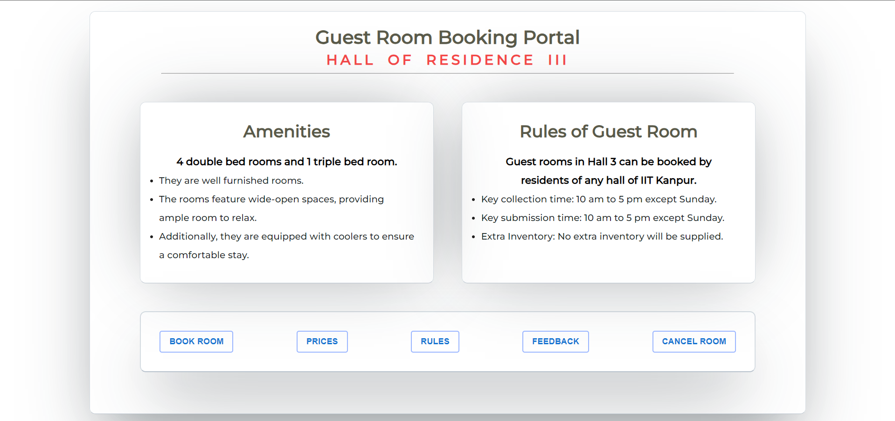
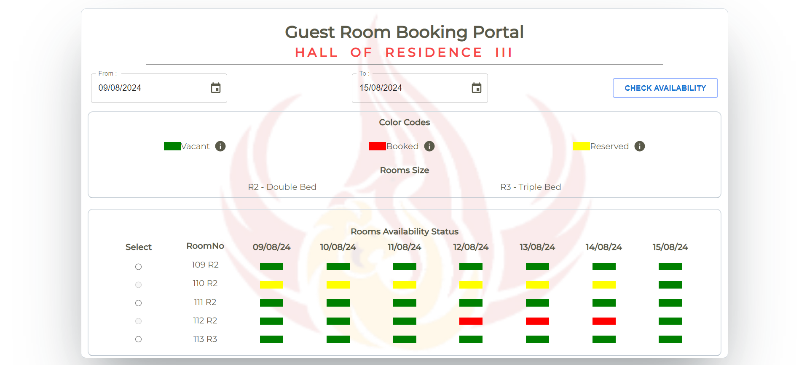
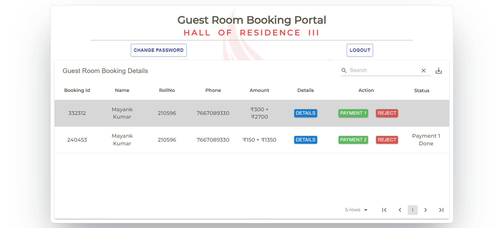

# Guest Room Booking Portal for Hall of Residence 3, IIT Kanpur

Welcome to the Guest Room Booking Portal for the Hall of Residence 3 at IIT Kanpur. This portal is designed to streamline the booking process for guest rooms, providing a user-friendly interface for residents and visitors to make reservations efficiently and securely.







## Features

- **Room Booking**: Users can select rooms, specify arrival and departure dates, and provide details for the visitors.
- **Indentor Details**: Collecting and verifying the details of the indentor including name, email, phone, and roll number.
- **OTP Verification**: Sending OTP for booking confirmation to ensure the authenticity of the request.
- **Form Validation**: Comprehensive validation for room details, visitor details, and indentor details.
- **Data Persistence**: Securely storing booking details in a MongoDB database.
- **Separate Dashboards**: Different dashboards for warden and hall office control to manage bookings and other administrative tasks.
- **Rate Limiter**: Implementing rate limiting to prevent abuse of the booking system.
- **Analytics**: Providing analytics and reports for monitoring and management purposes.

  
## Technology Stack

- **Frontend**: Next.js@14.2.3
- **Backend**: Node.js@20.14.0 with Express
- **Database**: MongoDB Atlas
- **Email Service**: Nodemailer


## Installation

### Prerequisites

- Node.js@20.14.0
- npm or yarn
- MongoDB atlas

### Steps

1. **Clone the Repository**
   ```bash
   git clone https://github.com/mk0380/Hall_3_GuestRoom.git
   cd Hall_3_GuestRoom
2. **Create Environment Variables File (.env) file, with the help of .env.example**
3. **Install Dependencies**
   ```bash
   npm install --force
4. **Running the Application**
   ```bash
   npm run dev

### Steps (Docker)

1. **Clone the Repository**
   ```bash
   git clone https://github.com/mk0380/Hall_3_GuestRoom.git
   cd Hall_3_GuestRoom
2. **Fill the appropriate Environment Variables in the docker-compose.yml->environment file, with the help of .env.example**
3. **Run**
   ```bash
   docker-compose up

### Usage

- Open your browser and navigate to http://localhost:3000 (or the appropriate URL if deployed).
- Make sure to add your admin emails in the important-data section for using the warden or hall office dashboard for administrative tasks and monitoring.
- Make sure to remove the presence of @iitk.ac.in in the indentorDetailsSchema, which would allow you to book it through any of your email.
- Select the desired room, fill in the required details (arrival, departure, visitor details), and submit.
- Check your email for the OTP and enter it to confirm the booking.

### Acknowledgments
We would like to thank the following for their support and contributions:
- The IIT Kanpur community for their feedback and support.
- Contributors to the open-source libraries and tools used in this project.

### Support
  If you encounter any issues or have any questions, contact the project maintainer at [mayankkr21@iitk.ac.in].
